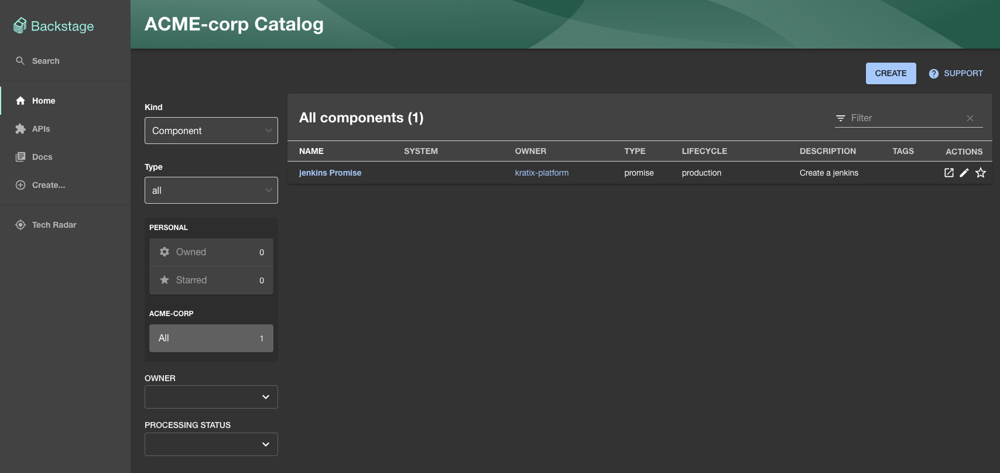
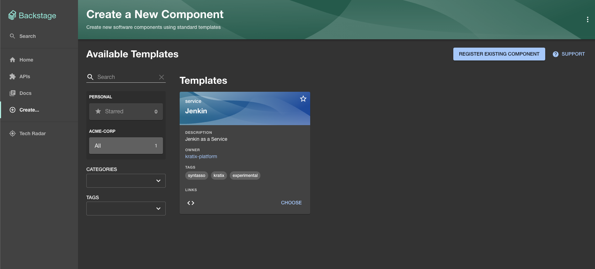
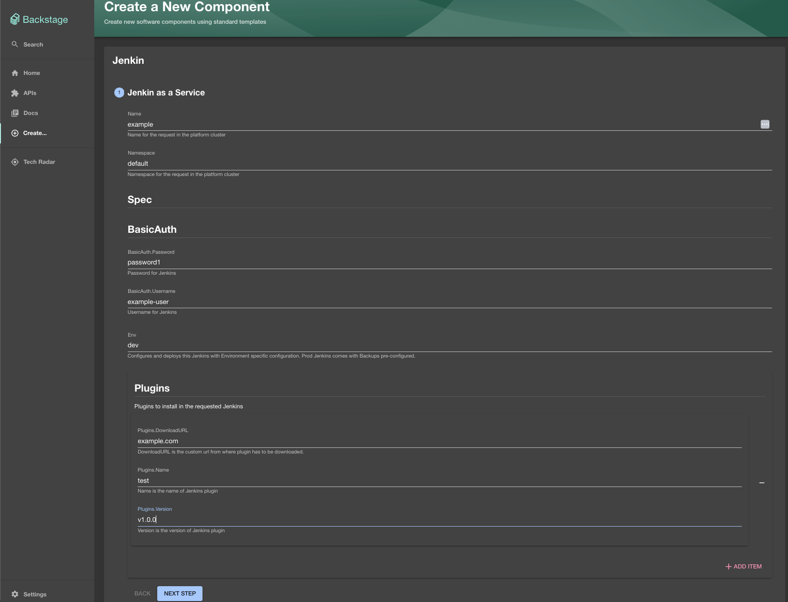
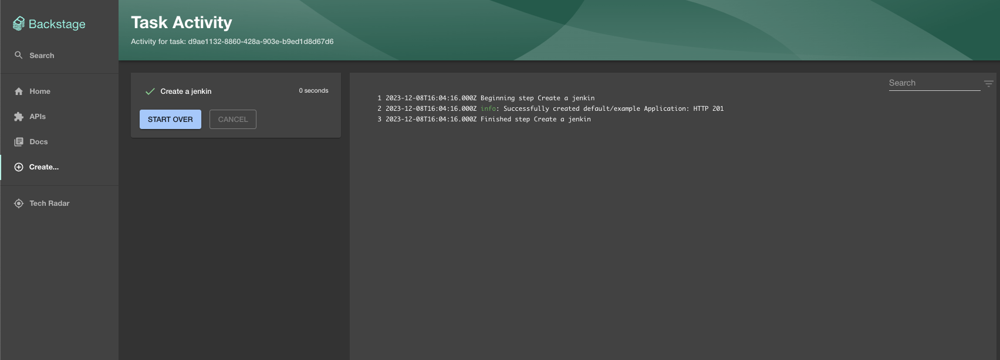
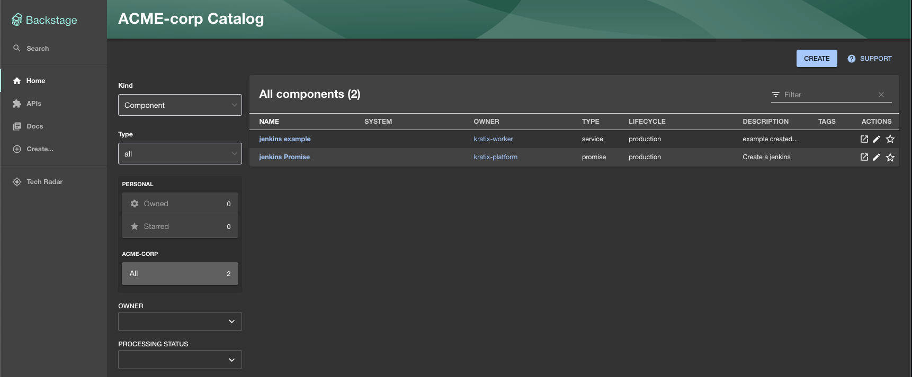

# kratix-backstage-generator-pipeline
Generate templates and components for your Kratix Promises automagically.

## Requirements
This promise uses the [kubernetes-apply](https://github.com/muvaf/kubernetes-apply)
plugin to make Kubernetes requests. See [Kratix Backstage docs](https://kratix.io/docs/main/reference/backstage/intro)
for setting up Backstage.

## Usage
run `make build-and-load` to load the image into your platform cluster. Update
your promises to have:
```
- image: ghcr.io/syntasso/kratix-backstage-generator-pipeline:v0.1.0
  name: backstage
```

in the promise and resource workflows

## Example
Checkout the `promise-example.yaml` file for an example.

```
make build-and-load

kubectl apply -f promise-example.com

kubectl get pods -n kratix-platform-system
NAME                                                 READY   STATUS      RESTARTS   AGE
configure-pipeline-jenkins-9db79-wsdkz               0/1     Completed   0          11s
kratix-platform-controller-manager-8bd596bf6-jq9z9   2/2     Running     0          48m
minio-f98c47d64-whj42                                1/1     Running     0          48m

```

This will populate backstage with a Component for the Promise:


and a Template:




Which results in the resouce being created:
```
kubectl get jenkins
NAME   STATUS
example   Resource requested
```

And a component being added to Backstage:



## Limitations
- CRD fields with `x-kubernetes-preserve-unknown-fields` set to `true` will
  result in an empty field being displayed in Backstage.
- The CRD must have a `singular` and `plural` that are only differentiate by the
  character `s`. E.g. `redis` and `redises` is not valid, but `redis` and
  `rediss` is.
  - This is due to a bug in https://github.com/muvaf/kubernetes-apply.
